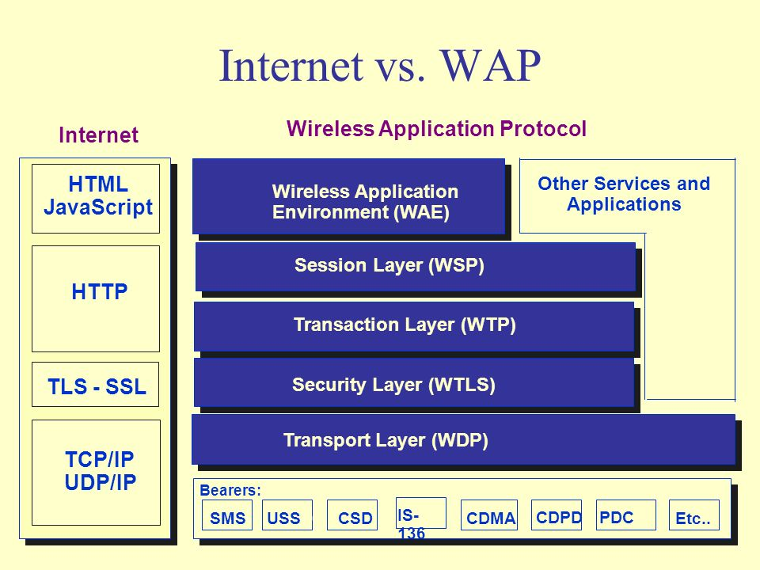

<!--
$theme: gaia
template: gaia
-->

移动开发

===
##### <right>作者：任文鑫</right>

---

移动开发简介
===
1. 基本的分类
2. 基本的概念
3. 基本的历史
---
分类
===

1. 原生App开发(Android, iOS)
2. 基于标记的页面开发（Web Apps, PWA)
3. 混合开发(Cordova)
4. *Web到原生的解析式***桥接**开发（React Native / NativeScript)

---

原生APP开发
===

1. 手机开发早期
手机厂家自行开发或者仅与合作伙伴开发。  

2. 功能机时代
出现了SDK与统一规范的平台。
出现了J2ME，Symbian，Windows Mobile三个主要的开发平台；还包挌MTK平台的一些SDK开发。

3. 智能机时代
主要是iOS和Android两大平台。
iOS以苹果iPhone 1为标志(2007)。
Android以T-mobile的G1为标志（2009)。

---

基于标记的页面开发
===
1. WAP标记语言开发
WAP协议
WAP标记语言
2. WAP 2.0 一次与HTML融合的尝试
Mobile Profile
3. HTML5移动开发
多屏开发与Media Query的出现
HTML5规范的形成
    
---
了解WAP体系与互联网体系的差别
===

1. WAP是针对低速无线网络开发的，互联网并没有这个限制
2. WAP的协议栈与互联网不同
3. WAP的标记规范不同,一个是WML，一个是HTML
4. WAP已经不再继续，即WAP网站基本上已经消失

---
比较
===

---
理解WAP站与移动Web的差别
===
1. WAP站与(移动）Web站是完全不同的事物
WAP站是低速、低智能手机时代的移动网络站点
移动Web高速、高智能移动设备、多屏时代的通用网站技术
2. WAP目前基本上已经消失，移动Web站，刚开始兴起
1.HTML5
2.PWA
---

WAP站基本特点
===

1. 基于WML / 基于XHTML的mobile profile版本
2. 使用WMScript，WAP 2.0后可以使用XHTML
3. 普通的浏览器无法访问，只有Opera这样的浏览器可以访问
4. 规范简单，互动性差
5. 基于WAP协议或者通过HTTP网关获取WML等资源
6. 处于逐步消失的状态

---

移动Web站基本特点
===

1. 基于HTML规范，是HTML5之后兴起的技术
2. 可以支持所有的HTML规范
3. 能对多屏的访问做出不同的响应，以优化用户体验
4. 基于TCP/IP协议栈，以HTTP和WebSocket为主要协议
5. 刚刚兴起，新技术不断的出现。比如PWA（Progressive Web Applications)
6. 未来可能在多数场景下可取代原生应用

---

移动Web核心技术与理念
===

1. UI设计理念（响应式，材料设计）
2. Media Query，viewport为基础的多屏适配技术
3. HTML5 + CSS3
4. PWA(Progress Web Applications)技术让Web App功能更加的强大

---

混合移动开发
===

1. 原理：
	将原生与标记规范（通常是HTML）结合起来
2. 技术栈：
	WebView + HTML/CSS/JS
3. 最成功的实现框架
	cordova/phonegap
---

Web到原生的解析式桥接开发
===
1. 原理：
	通常是将JS/CSS/HTML代码，通过解析器，转化成相应的原生调用。
2. 技术栈：
	JS + 平台规范 + 接口规范
3. 常见的实现框架：
	React Native（最流行）, NativeScript（有Google支持)
---

各种平台的典型方案
===
---

一、原生平台
===

#### Android
	1. 编程语言:Java
	2. 开发环境： Android SDK + 主流操作系统
	   (WIN, GNU/Linux, Mac OS)
	3. 官方IDE: Android Studio
### iOS
	1. 编程语言: Object C, swift
	2. 开发环境： XCode + Mac OS Only
	3. 官方IDE: XCode

---

二、Web应用平台
===
1. 常见的移动UI方案
	a. Bootstrap: 使用最广泛的Web UI框架之一
    b. Angular Materail：与Android风格通用的UI框架
2. 常见的应用框架
	1. Angular.js
	2. Vue.js
	3. React.js
3. 技术规范
	PWA（Progressive Web Applications)

---

三、混合应用平台
===
1. 基础成熟方案：cordova/phonegap
2. 全套方案：ionic = UI + 交互 + cordova
3. 编程语言：主要是Javascript，扩展时需要使用到（Java/Object-C)
4. 开发环境： 常规Web开发环境 + 主流操作系统(WIN, GNU/Linux, Mac OS)
5. 基于WebView组件

微信小程序也是基于WebView组件开发的

---

四、解析式桥接方案
===
1. 常见框架：React Native, NativeScript
2. 开发环境：Node.js + 手机环境（Android, iOS)
3. 技术栈： Web 技术 + 原生技术

---

各类技术的优势与劣势
===

---
原生技术的优势与劣势
===
#### 优势

1. 通常执行速度快，响应迅速
2. 用户体验好
3. 可以最大限度发挥平台的优势

#### 劣势
1. 通用性差，代码无法移植
2. 学习成本大，开发成本高

---
移动Web的优势与劣势
===
#### 优势
1. 开发成本，学习成本相对较低
2. 技术成熟，通用性强
3. 升级方便，发布简单，即时更新

#### 劣势
1. 影响速度低于原生应用
2. 就是无法及时跟近最新的硬件变化

---

混合应用的优势与劣势
===
#### 优势
1. 可以随时接入新硬件的接口
2. 可以最大限度的使用Web技术

#### 劣势
1. 影响速度低于原生应用，与Web应用基本一致
2. 有一个的学习门槛
3. 成熟度有时候不够

---
Web到原生的解析式桥接开发
===

#### 优势
1. 可以获得接近于原生的性能
2. 可以直接基于Web技术和Node.js技术进行应用开发

#### 劣势
1. 有一定的技术门槛
2. UI不同平台不一样
3. 成熟度仍有待观察
4. 其它专利相关的风险（最近RN的专利风险问题，很多公司放弃了RN）

---

如何选择一种适合你的方案？
===
通常我们可以采用以下的优先标准来构建我们的应用：

1. 没有硬件交互或者只需要浏览器支持的硬件交互，那么Web应用就可以了。
2. 有一些浏览器不支持的硬件交互，并且交易不频繁，那么混合应用比较适合。
3. 对于混合应用的影响事满意，或者硬件交易挺多，但是性能要求不高，可以考虑采用解析式原生桥接应用
4. 如果以上都达不到要求，那么考虑采用原生应用。

