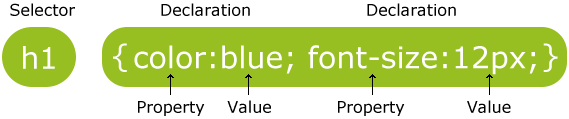
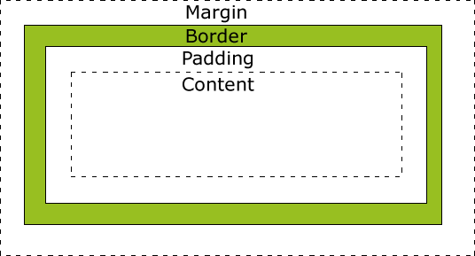

<!-- 

$theme: gaia
template: gaia

-->

Web前端技术基础<p style="text-align:right;font-size:28px;margin-right:50px;color:#cFc;">:star: by calidion</p>
===

---
:heart: 前端三宝
===
##### HTML

主要负责数据与结构，少量负责展现，数据交互（通过表单）

##### CSS(Cascading Style Sheet)
主要负责展现，包括一部分的交互

##### Javascript

Javascript是前端技术里功能最强大的地方。可以负责所有的前端功能。但是目前越来越向业务和交互逻辑的方向发展。

---

发展趋势
===
##### HTML
更加的语义化，可定制化，组件化

##### CSS
展示功能更加丰富，兼带越来越多的常规交互的功能

##### Javascript
提供更多的硬件功能，更多的接口，以HTML5的出现为发展标志

---
常见的浏览器
===
浏览器：分渲染内核与JS引擎

| |Firefox|Chrome|Edge/IE|Safari|
|:-:|:-:|:-:|:-:|:-:|:-|
|***公司***|Mozilla|Google|MS|Apple
|**内核**|Gecko|Blink|Trident|WebKit
|**JS引擎**|SpiderMonkey|V8|Chakara|Nitro

---

HTML技术基础
===

HTML是 `HyperText Markup Language` 的缩写。
中文意思：`超文件标记语言`

HTML是整个Web页面的起点。

HTML是由SGML演化而来的。

---

HTML需要关心那些问题？
===

1. 页面的基本结构、描述、设定
2. 样式、脚本，多媒体的加载
3. 字符编码
4. 表单和基本的UI组件
5. 网页结构或者内容划分
6. 表格
7. 数据的提交

---
基本的页面
===

```html
<!DOCTYPE html> 
<html>
  <head>
  </head>
  <body>
    <h1>Hello World!</h1>
  </body>
</html>
```

将这代码放入以.html为扩展名的文件中，即可完成一个基本的HTML文件。

---
说明
===
这个页面结构包含了以下几个内容：
1. DOCTYPE声明
2. html，head，body, h1等元素
3. h1元素所包含的正文内容

这些元素组成了文档结构
“Hello World!"则是文档的内容。

---
DOCTYPE声明
===
1. 帮助浏览器确定网页的解析方式
2. 由于早期的浏览器版本不认别CSS或者认别的能力不足，为了区分新旧的HTML文件而引入
3. 发展出来loose, strict, transitional等标准
4. HTML5之后统一于`<!DOCTYPE html>`这种形式。
5. DOCTYPE可以小写，但是通常推荐大写，以示与HTML的标签的区别。
---
DOCTYPE变化的原因
===
1. DOCTYPE过多，导致开发复杂，兼容困难
2. 依照SGML的规则对网页进行严格解析，会降低开发者的生产力。（XHTML的错误路线）
3. HTML5之后不再严格按SGML进行解析，但是不禁止开发者使用SGML的校验工具（XHTML Validator)
---

html标签
===
1. 是HTML文档的起点和终点
2. 包含除本身外的所有HTML标准
3. 他的两个重要子元素：head、body。
4. 其中head表示网页的一些主要信息与控制
5. body表示网页的内容

---
head标签(1)
===


### 指定网页标题

```html
<head>
  <title>Title of the document</title>
</head>
```
---

head标签(2)
===

### 添加样式
```html
<head>
  <style>
    h1: {
      color: red;
    }
  </style>
  <link rel="stylesheet" href="style.css">
</head>
```

---

head标签(2)
===
### 添加脚本
```html
<head>
  <script>
    document.write("Hello World!");
  </script>
  <script src="main.js"></script>
</head>
```

---

head标签(3)
===
### 添加HTTP控制信息

```html
<head>
  <meta charset="UTF-8">
  <meta name="description" content="描述信息">
  <meta name="keywords" content="HTML,CSS,JavaScript">
  <meta name="author" content="李白">
  <meta http-equiv="refresh" content="30">
  <meta http-equiv="refresh" 
  content="3;url=https://www.mozilla.org">
  <meta name="viewport" 
  content="width=device-width, initial-scale=1.0">
</head>
```
---
多媒体标签(1)
===
1. 图片
```html

```

---
多媒体标签(2)
===
2. 视频
```html
<video 
src="videofile.webm"
autoplay 
poster="posterimage.jpg">
</video>
```
---
多媒体标签(3)
===
3. 音乐
```html
<audio controls>
  <source src="horse.ogg" type="audio/ogg">
  <source src="horse.mp3" type="audio/mpeg">
</audio>
```

---
表单(1)
===

作用： 基于HTTP协议向服务器提供请求
### 提交普通的表单（urlencode)

```
<form action="/update" method="post">
  First name: <input type="text" name="fname"><br>
  Last name: <input type="text" name="lname"><br>
  <input type="submit" value="Submit">
</form>
```

> 建议表单只使用POST请求

---
表单(2)
===
#### 提交文件表单（multipart/form-data)

```
<form action=""  method="post" 
	enctype="multipart/form-data"
>
<label for="file">Filename:</label>
<input type="file" name="file" id="file"><br>
<input type="submit" name="submit" value="Submit">
</form>
```
1. form标签一定要写上 `enctype="multipart/form-data"`
2. 有一个`type="file"`的input标签
3. 一个提交按钮
---
基本的结构元素
===
1. div
最常用的结构元素，div与语义化是两个极端。（参考组件化）
2. table
用于表达复杂的列表数据。
3. 列表(ul/ol/dl)
用于表达以行(row)为主的列表数据。

---
div
===

div是最常用的结构元素，它用来表示对一个页面结构的划分。

div是一个没有过多默认表现属性的块级元素，可以应用于很多页面结构的开始结构。

但是也极容易被误用，导致整个页面出现过多的div，这种现象叫做divities(div滥用）。

`div不管布局，布局是CSS的事情，不是HTML元素的事情`

---
table
===
用来表达复杂的表结构，特别是多列的结构。
有很多子元素去完善表内容。主要的有tr, td, th。


```
<table>
  <tr>
    <th>一月</th>
    <th>二月</th>
  </tr>
  <tr>
    <td>1.0</td>
    <td>2.0</td>
  </tr>
</table>
```

---
列表(1)
===

#### 无序列表(ul, unsorted list)
```
<ul>
  <li></li>
  <li></li>
</ul>
```

#### 有序列表(ol, ordered list)
```
<ol>
  <li></li>
  <li></li>
</ol>
```

---

列表(2)
===

描述表(dl, description list)

```
<dl>
  <dt>Coffee</dt>
  <dd>- black hot drink</dd>
  <dt>Milk</dt>
  <dd>- white cold drink</dd>
</dl>
```
---
内容元素
===
内容元素主要是指那些有语义、或者有内容、或者对内容进行表现或者描述的元素。

主要分成两类：
1. 语义为主的元素
2. 表现为主的元素

---
语义元素
===

h1~6：标题
```
<h1></h1>
<h2></h2>
...
<h6></h6>
```
p：段落
```
<p></p>
```
br：换行

```
<br/>
```

---
常见表现元素
===

1. b/strong/small
粗体/粗体/小字体
2. i/em
斜体/强调
3. sub/sup
下标/上标
4. del/ins
删除/插入
5. mark
标记

---
通用属性
===
#### `class`： 定义一个或者多个类属性。
形式: `class="classname1 classname2"`
#### `id`： 定义元素的ID，全局唯一
#### `style`： 定义内联的CSS属性
#### `title`： 定义元素的额外信息（通常会显示成提示）

---
实体
===
#### 实体的作用
1. 表示一些HTML保留的字符，如"<", ">"," "(空格）
2. 表示一些特殊字符、商标或者特殊
3. 表示一些Unicode的编码字符
---
实体的表示方式
===

#### 1. &实体名;

#### 2. &#实体的UNICODE数值;

对于"<"，可以表示为:

`&lt;`、`&#60;`

---
几个常用实体
===
小于号"<": `&lt;`
大于号">": `&gt;`
空格： `&nbsp;`
&号：`&amp;`
&copy;: `&copy;`
&trade;: `&trade;`

表示汉字等Unicode
如“中”字：`&#20013;`

---
小结
===
HTML主要用于表达网页的结构、数据
HTML5之后对于语义化更加的看重
同时随着组件化热朝的到来，自定义标签将会成为主要的使用形式

---

Cascading Style Sheets(CSS)
===
---
CSS
===
### 作用
用于定义HTML元素的展示
### 为什么会被引入？
1. HTML的表现元素太多，导致页面拥肿，无法理解，无法修改的问题。
2. 解决无法实现一些展示效果的问题

---
好处
===
1. 节约时间
2. 精减HTML的表现性标签
3. 方便项目组织

#### 什么时候被引入？
在HTML 4.0时被添加

---
CSS语法
===

### 包含两个部分：

1. 选择器(selector)

2. 一个或者多个由属性与值组成的声明（declaration）

 
 
---
基本的格式
===
### 单行
```
p {color:red;text-align:center;}
```
### 多行
```
p {
  color:red;
  text-align:center;
}
```
---
选择器
===
1. id选择器
2. 类选择器
3. 元素选择器
4. 后代选择器
5. 儿子选择器
6. 属性选择器
7. 伪类

---
### id选择器(#id)
选择id为对应值的所有元素
如对于HTML
```
<a id="anchor">Hello</a>
```
对应的CSS可以是
```
#anchor { color: red}
```
---

### 类选择器(.className)
选择class为对应值的所有元素
如对于HTML
```
<a class="anchor">Hello</a>
```
对应的CSS可以是
```
.anchor { color: red}
```
---
### 元素选择器(element)
选择所对应标签的所有元素
如对于HTML
```
<a>Hello</a>
```
对应的CSS可以是
```
a { color: red}
```
---

### 后代选择器(element element)
选择第一个标签下所有标签为第二个标签的元素
如对于HTML，要选择p标签里的a标签
```
<p> Out side <a>Hello</a> ... </p>
```
对应的CSS可以是
```
p a { color: red}
```

---

### 儿子选择器(element>element)
选择以第一个标签为父节点的所有是第二个标签的元素
如对于HTML，要选择p标签里的a标签
```html
<div>
  <p>Out</p>
  <p>span1<a>Hello</a></p>
  <form>
    <p>new</p>
  </form>
</div>
```
要选中标有颜色的元素的CSS可以是
```css
div > p { color: red}
```
---

### 属性选择器（[target])
1. 选择所有包含指定属性的元素
[target]
2. 选择所有包含指定属性值等于指定值的元素
[target=_blank]
3. 选择所有包含指定属性值包含指定值的元素
[title~=flower]
4. 选择所有包含指定属性值以指定值开始的元素
[title|=flower]

---
### 伪类

1. 所有未访问的链接
:link
2. 所有未访问的链接
:visited
3. 所有活动的链接
:active
4. 鼠标经过的链接
:hover

---
盒子模型
===
所有的`块级元素`都被认为是`盒子`。都遵从盒子模型。
<p style="position:absolute;left:320px;"></p>

### 盒模型

1. 边距(margin)

2. 边框(border)

3. 填充(padding)

4. 内容(content)

---
元素的Width和Height
===

通过CSS指定的元素Height/Width是Content的对应值

计算实际元素所占的Height/Width的公式如下：

full width = width + left padding + right padding + left border + right border + left margin + right margin

full height = height + top padding + bottom padding + top border + bottom border + top margin + bottom margin

---
#### 定位

1. static
默认的属性。定义top,left,bottom,right对于这个属性的元素无效
2. relative
定义相对与本来的位置的偏移
3. absolute
根据第一个非static父元素进行定位。没有找到时，以html作为父元素
4. fixed
定义相对于浏览器窗口的位置，不随浏览器的滚动条变化而变化
---

#### 垂直定位

当不同的定位类型相结合时，就会出现元素内容相互重叠的情况

z-index用来解决重叠时的查看顺序

z-index顺序是从大到小，大的在前面

值可以是任意的整数，auto, inherit

---
文档流与浮动
===
### 什么是浮动？

让文档流发生变化的技术

因为文档流是有方向的，

所以浮动只有左右，没有上下

### 文档流
static元素的累加方向

---


如何实现浮动？
===
使用float

可用值：left, right

### 作用范围
所有后面的元素
### 消除浮动
clear:both
---


