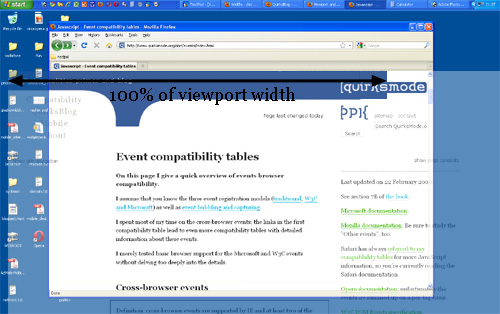
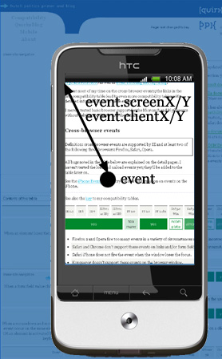
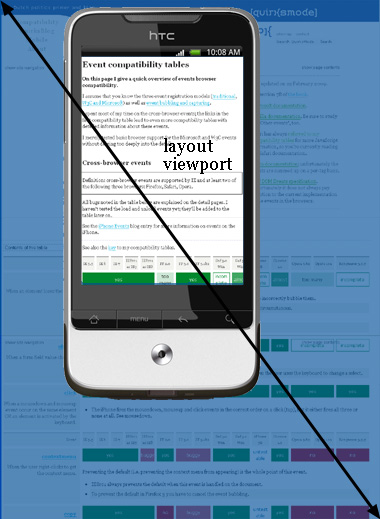
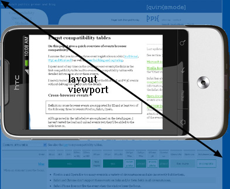
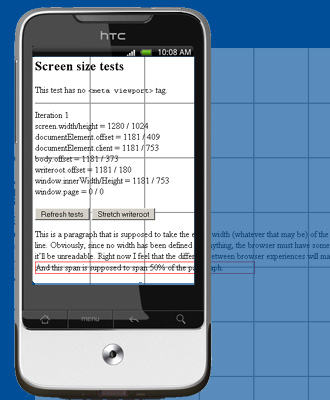

<!-- 

$theme: gaia
template: gaia

-->

移动Web开发核心技术<p style="text-align:right;font-size:28px;margin-right:50px;color:#cFc;">:star: by 任文鑫</p>
===

---
移动Web开发核心技术
===
1. 多屏相关的概念与技术(viewport/media query/scale等概念)
2. 象素及相关的概念(物理相素，CSS相素）
3. 象素单位的选择(rem, px, em)
4. CORS（让Web页面可以脱离网站发起HTTP请求）
5. WebSocket(让Web页面可以开发需要长连接的交互网站）

---

设备象素 VS CSS象素
===
设备象素：screen.width/height
CSS象素：即CSS设定的象素

假设CSS象素与设备象素在一开始是一致的。
当放大一个DOM元素时，CSS象素与设备象素会出现不一致的情况。

---
一致时：

 
 
放大后：（原来的设备只能显示更少的网页）

 


---
缩小后：（原来的设备能显示更多的网页）

 
 

## 结论：

`在100%的缩放比例下，CSS象素与物理象素一致`

---

屏幕大小： (screen.with/screen.height)

 
 
---
 
Window大小: (window.innerWidth/window.innerHeight)

 
 
---
Window大小: (包括滚动条)

 

---

滚动后的偏移:(window.pageXOffset/window.pageYOffset)

 

---

滚动后的偏移:(放大后值不会变)

 

---

viewport
===

功能：包裹html标签

默认：html的宽度是浏览器window的宽度

1. 不属于HTML的DOM元素
2. 无法使用CSS进行修改

桌面：只有浏览器的width和hieght
移动端：更加复杂。

---
放大后，viewport会变的比HTML的可显示区块小：

 
 
---
viewport只在100%的缩放时与HTML大小一致：
 
 
 ---
 
 文档宽度?
 ===
 
 
 
 ---
 
测定viewport的数据
===
1. 没有设置html的高与宽

document.documentElement的clientWidth/clientHeight

a. 与根元素html的高宽一致
b. 与viewport的高宽一致

---

如图：


 
 
---
2. 设置了html的高与宽

document.documentElement的clientWidth/clientHeight

a. 与根元素html的高宽不一致
b. 与viewport的高宽一致

---

如图：


 
 
---
结论
===

### document.documentElement的clientWidth/clientHeight
### 始终与viewport一致

---

viewport与window.inner(Width/Height)的关系
===
1. window.inner(Width/Height)
viewport = window.inner - 滚动条

---
测定html的数据
===

宽度：document.documentElement.offsetWidth

高度：document.documentElement.offsetHeight

不无是html设置高度还是没有设置

---

未设置高度


---
设置高度


---

鼠标事件坐标
===
---
桌面
===

当鼠标事件发生时，跟有讨论有关系参数有三个：
1. pageX/Y
相对于html元素的CSS象素距离
2. clientX/Y
相对于viewport的CSS象素距离
3. screenX/Y
相对于屏幕的设备象素距离

---
PageX/Y
===


---
clientX/Y
===


---
screenX/Y
===


---

移动
===

当鼠标事件发生时，跟有讨论有关系参数有三个：
1. pageX/Y
相对于html元素的CSS象素距离
2. clientX/Y
相对于visual viewport的CSS象素距离
3. screenX/Y
相对于屏幕的设备象素距离,与clientX/Y实际上是一样的。不需要关心

---
PageX/Y
===


---
clientX/Y/screenX/Y
===



---

Media Query(媒介查询/请求）
===
基于对设计类型以及设备的属性的选择，应用不同的CSS样式。
常见的设备类型有：print, screen
常见的属性有： 浏览器viewport的width

随着现在的Web设备越来越多，Media Query对于构建异构硬件有很大的价值。

---
示例

```
div.sidebar {
	width: 300px;
}

@media all and (max-width: 400px) {
	div.sidebar {
		width: 100px;
	}

}
```

这样当viewport的宽度不超过400px时， div.sidebar的宽度就是100px，而不是300px了。

---

最重要的几个属性
===
1. width/height
与documentElement .clientWidth/Height一样，即viewport的宽度与高度
基于CSS象素

2. device-width/device-height
与screen.width/height
基于设备象素

---
图示:

桌面


桌面是仅使用width即可


---
图示:

移动


---

移动设计上的两个viewport
===
1. 可视viewport(visual viewport)

手机上可以看到的区域

2. 布局viewport(layout viewport)

基于CSS布局计算出来的区域，不同的浏览器的计算方式不同

3. 两个view都是基于CSS象素的（可喜的是）

---
图示
===


---
理解layout viewport
===
1. 大部分默认完全缩小到visual viewport一致


---
2. 不缩小



---
横屏效果




---

测定layout viewport
===
<p style="position:fixed;top:150px;right:50px;width:480px;">document.documentElement的<br/>
clientWidth/clientHeight<br/>
对应layout viewport的<br/>
宽高</p>


---
测定visual viewport
===
<p style="position:fixed;top:150px;right:50px;width:580px;">window的<br/>
innerWidth/innerHeight<br/>
对应visual viewport的<br/>
宽高</p>


---

meta viewport标签
===

#### 说明

1. 最初是苹果的一个标签
2. 作用是重新设置layout view的长度

`<meta name="viewport" content="width=320">`

---

#### 引入原因

在元素没有设置`width`的情况下，`layout view`会被完全缩放到`visual viewport`里。
如下图：


---

#### 手动放大后(早期只有Android支持）



---

#### 设置meta后


---
layout viewport与device-width之间的差异
===
device-width通常与screen.width是一致的。
layout viewport与device-width之间存在复杂的关系。

---
第三个viewport（ideal viewport）
===

它给出网页在设备上最理想的大小。

因此不同的设备有不同的ideal viewport规格。

在retina屏之前，大多的理想viewport与物理的象素大小是一致的。

但是对于iPhone 4S之前的版本来说，不管是不是retina屏，理想viewport都是320x480。
这样这个宽度是最佳的Web显示效果。

---

ideal viewport 两个重要的事件
===
1. layout viewport可以被设置成ideal viewport。

`<meta name="viewport" content="width=device-width,initial-scale=1">`

2. 所有的缩放(scale)相关的指令都是基于ideal viewport的。比如maximum-scale=3只允许layout viewport被放大到3倍的ideal viewport

---

如何获得ideal viewport的值？
===
刚才说到layout可以被设置成ideal viewport，即设置 

```
<meta name="viewport" 
content="width=device-width,initial-scale=1"/>
```

这时：document.documentElement的clientWidth和clientHeight就是ideal viewport相应的值。

---
ideal viewport的兼容性问题
===
共有三个：

1. 设置了`width=device-width`后，`layout viewport`与`ideal viewport`是不是相同？
2. 设置了`initial-scale=1`后，`layout viewport`与`ideal viewport`是不是相同？
3. screen.width/height是不是与`ideal viewport`一致。

详情：
https://www.quirksmode.org/mobile/metaviewport/#t02

---
Layout viewport的宽度
===
1. 默认980px或者1024px
2. meta可以设置
3. 有些有最小尺寸。比如Android Webkit是320px

兼容性测试
详情：
https://www.quirksmode.org/mobile/metaviewport/#t10

---
缩放(zoom)
===
1. 无法直接获得缩放系数，但是与visual viewport的宽度成反比。
2. 缩放系数与ideal viewport相关，而与layout viewport无关

搞清楚这两点，下面就是名字的问题。
对于苹果来说，缩放就是scale。
所以viewport有三个不同的属性：`initial-scale`,`minimum-scale`和`maximum-scale`

由于苹果的先发性，其它浏览器基本只能是被迫遵从。

---
公式
===
```
visual viewport width = ideal viewport width / zoom factor

zoom factor = ideal viewport width / visual viewport width
```
当ideal viewport宽度是320px并且缩放系数是2时，visual viewport的宽度就是160px。

而layout viewport与缩放是无关的。

---
最大与最小的缩放系数
===
缩放系数不能无限放大与缩小

visual viewport不能大于layout viewport

所以对于很多实际的最小缩放比例是ideal viewport和layout viewport的宽度比。

https://www.quirksmode.org/mobile/metaviewport/#t20

---
initial-scale
===
设置`initial-scale`后它会做两件事情。

1. 设置页面的缩放比例为设定值， 计算出与ideal viewport的相对值， 然后确定visual viewport的宽度
2. 将layout viewport的宽度设置成是visual viewport的宽度

---
指示符冲突
===
因为`initial-scale`会设置layout viewport的宽度，而width也会设置layout viewport的宽度，

所以我们很容易设置一个冲突的指示，比如：
```
<meta name="viewport"
content="initial-scale=1,width=400"/>
```
---

浏览器如何处理呢？
===
答：选择值比较大的那一个。

比如在坚屏时iPhone的宽度是320px;那么400被设置。
在横屏时iPhone的宽度是480px;那么480被设置。

---

这里所有讨论的所有象素都是逻辑的，而不是物理的，包括讨论的设备象素。
===

---

px vs rem vs em
===

1. px: 最常用，即CSS象素
2. rem: 相对于根元素html的字体大小进行计算的
3. em：相对于父元素的比例

结论：

推荐px, rem一起使用，适当的使用em.

---
px
===

优势：
1. 直观：直接与CSS象素对应
2. 成熟：已经使用了很长时间，经历了时间的考验
3. 兼容性好，可直接复制ps的值。

---

劣势：
1. 无法实现统一缩放。
最常见的场景是老人设置更大的字体。
默认浏览器是16px的字体大小，如果使用了px，当切换成20px时，其它的字体无法相应的变大。

---
rem
===
优势：
1. 比较好的解决了px中存在的问题

劣势：
1. 尙不成熟
2. 没有经过大规模验证
3. 仍需要计算

---
em
===
优势：
1. 可以确定相对的大小

劣势：

2. 嵌套时会出现问题

---
CORS
===
出于安全原因，浏览器限制脚本的HTTP请求的跨域。即同源策略（same-origin policy）。
为了提升Web的功能，开发者要求浏览器厂家开放HTTP请求的权限。
因些形成了这个跨域资源共享（Cross-Origin Resource Sharing）的机制

---


---
CORS是一个三方机制
===
参与者包括了前端开发工程师，后端开发工程师，还包括了管理员。

因为CORS需要在浏览器与服务器同时响应参数。

并且主要还是服务器端的工作，这个工作可以由管理员来承担，也可以由后端开发工程师来承担。

---

简单模式


---

预飞模式


---
重要参数
===

Access-Control-Allow-Origin：
指定允许的域名，通常用\*号表示接受所有的域。
```
Access-Control-Allow-Origin: http://mozilla.org
Access-Control-Allow-Origin: *

```

Access-Control-Allow-Methods: 指定允许的方法

```
Access-Control-Allow-Methods: POST, GET
Access-Control-Allow-Methods: *
```

---
开启安验证
===
有时候，服务器需要对请求进行用户验证。
所以这个时候需要启动cookies。
在CORS下面是设置withCredentials属性为true.

```
var req = new XMLHttpRequest();
req.withCredentials = true;

```


---
WebSocket
===


---
产生的原因
===

1. 聊天室
2. 游戏
3. 消息，通知
4. 实时更新（股票）

等等

---

之前的努力
===

1. polling
2. long polling
3. streaming
4. comet

---
当前状态
===

1. 尚没有完全结束
2. 移动端支持尚不完善

---
作用
===

1. 长边接，双向通迅（HTTP只支持Request-Response单向通讯）
2. 承继已有的HTTP的成果，从而让协议更加的可以利用现有HTTP成果
所以可以支持HTTP的代理等相关的技术
---

与TCP和HTTP的关系
===
通过HTTP建立握手关系
然后基于TCP协议进行通讯
是两种协议的混合体

---
标准
===

还没有进入正式发布状态

https://tools.ietf.org/html/rfc6455


 

 
 


 


