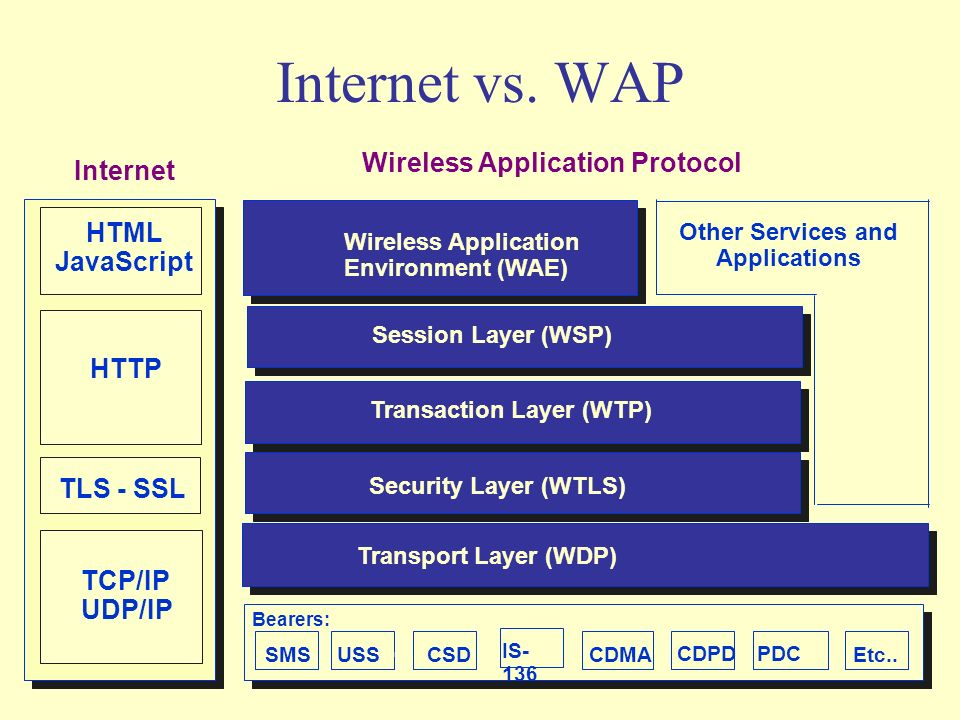

<!-- $theme: gaia -->

移动开发

===
##### <right>讲师：任文鑫</right>

---
移动开发简介
===
1. 基本的分类
2. 基本的概念
3. 基本的历史
---
分类
===

1. 原生App开发
2. 基于标记的页面开发
3. 混合开发
4. 基于JS/Web技术的原生解析技术

---

原生APP开发
===

1. 手机开发早期
	厂家自行开发或者合作伙伴。
    主要基于C/C++    

    
2. 功能机时代
	出现了SDK与统一规范的平台。
    出现了J2ME，Symbian，Windows Mobile三个主要的开发平台。还包挌MTK平台的一些SDK开发。

3. 智能机时代
	主要是iOS和Android两大平台。
    iOS以苹果iPhone 1为标志(2007)。
    Android以T-mobile的G1为标志（2009)。
   
---

基于标记的页面开发
===
1. WAP标记语言开发
	WAP协议
    WAP标记语言
2. WAP 2.0 一次与HTML融合的尝试
	Mobile Profile
3. HTML5移动开发
	多屏开发与Media Query的出现
    HTML5规范的形成
    
---
了解WAP体系与互联网体系的差别
===

1. WAP是针对低速无线网络开发的，互联网并没有这个限制
2. WAP的协议栈与互联网不同
3. WAP的标记规范不同,一个是WML，一个是HTML
4. WAP已经不再继续，即WAP网站基本上已经消失

---
比较
===

---
理解WAP站与移动Web的差别
===
1. WAP站与(移动）Web站是完全不同的事物
WAP站是低速、低智能手机时代的移动网络站点
移动Web高速、高智能移动设备、多屏时代的通用网站技术
2. WAP目前基本上已经消失，移动Web站，刚开始兴起

---

WAP站基本特点
===

1. 基于WML / 基于XHTML的mobile profile版本
2. 使用WMScript，WAP 2.0后可以使用XHTML
3. 普通的浏览器无法访问，只有Opera这样的浏览器可以访问
4. 规范简单，互动性差
5. 基于WAP协议或者通过HTTP网关获取WML等资源
6. 处于逐步消失的状态

---

移动Web站基本特点
===

1. 基于HTML规范，是HTML5之后兴起的技术
2. 可以支持所有的HTML规范
3. 能对多屏的访问做出不同的响应，以优化用户体验
4. 基于TCP/IP协议栈，以HTTP和WebSocket为主要协议
5. 刚刚兴起，新技术不断的出现。比如PWA（Progressive Web Applications)

---

混合App开发
===
混合移动开发：将原生与标记规范（通常是HTML）结合起来
技术基础：WebView + HTML/CSS/JS
常见的实现： cordova/phonegap

---
基于Web技术的原生解析技术
===
通常是将JS/CSS/HTML代码，通过解析器，转化成原生的代码再调用。
技术基础：JS + 平台规范 + 接口规范
常见的实现：React Native, NativeScript

---

